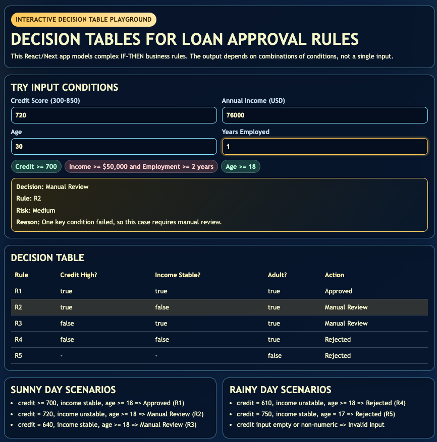
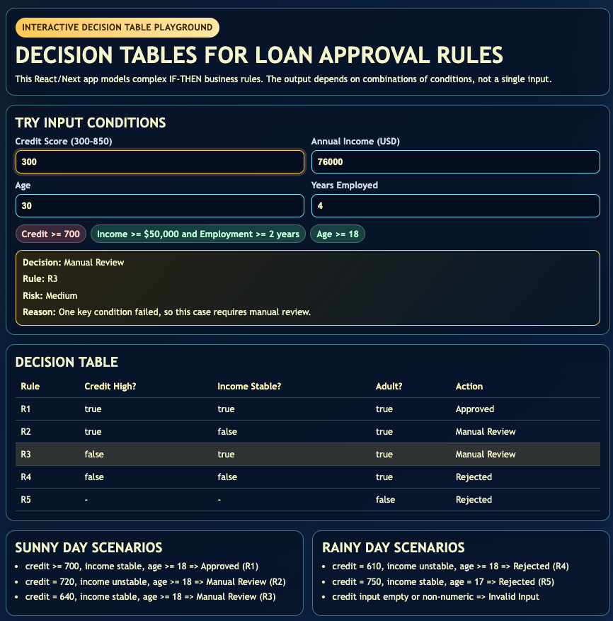
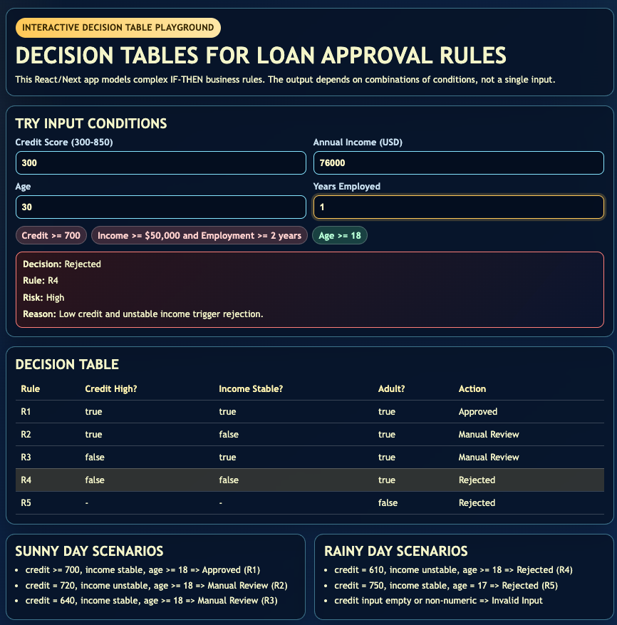
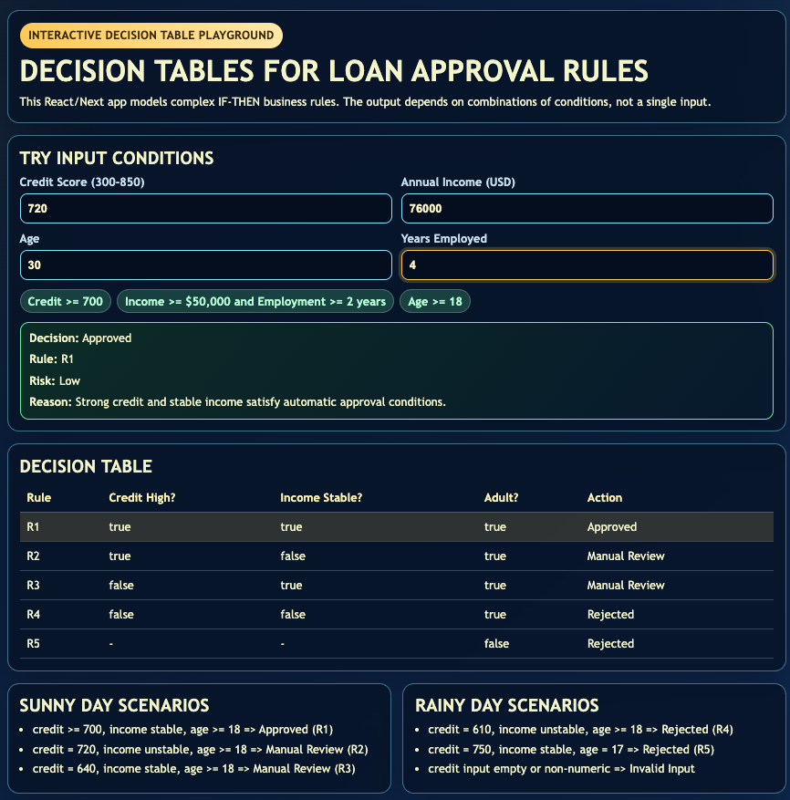

# Decision Tables - Vibe Coding Assignment (React/Next.js)

## Introduction
This assignment demonstrates the Decision Table test case methodology for complex business logic. A Decision Table is useful when a system decision depends on a combination of multiple input conditions instead of a single value.

In this sample app, the business problem is a simplified loan decision workflow. The app evaluates combinations of these conditions:

- Credit score is high (`creditScore >= 700`)
- Income is stable (`annualIncome >= 50000` and `employmentYears >= 2`)
- Applicant is an adult (`age >= 18`)

The app maps each unique condition combination to an expected action:

- Approved
- Manual Review
- Rejected

### When This Test Case Should Be Used
Use Decision Tables when:

- Business rules contain multiple IF-THEN branches.
- Different combinations of conditions produce different actions.
- You must verify full logical path coverage, not just single-field validation.
- Requirements include policy decisions (banking, insurance, eligibility, pricing, permissions).

### Limitations
Decision Tables are strong for logical combinations, but they have limits:

- They can grow quickly as conditions increase (`2^n` combinations for many boolean conditions).
- They are weaker for UX flow, performance, timing, and integration defects.
- They require clear and stable rules; vague requirements can create ambiguous tables.

## Vibe Coding Assignment
A React/Next.js mini app was implemented to illustrate Decision Table testing.

### App Summary
The app takes four inputs:

- Credit score
- Annual income
- Age
- Years employed

It computes three condition flags, finds the matching decision table rule, and displays:

- Decision status
- Matched rule ID
- Risk level
- Explanation

### Decision Table Used
| Rule | Credit High? | Income Stable? | Adult? | Action |
|---|---|---|---|---|
| R1 | true | true | true | Approved |
| R2 | true | false | true | Manual Review |
| R3 | false | true | true | Manual Review |
| R4 | false | false | true | Rejected |
| R5 | - | - | false | Rejected |

### Sunny Day Scenarios
Expected valid workflow outcomes:

- Input: credit 720, income 76000, age 30, employed 4 years -> Approved (R1)
- Input: credit 720, income 45000, age 24, employed 1 year -> Manual Review (R2)
- Input: credit 640, income 78000, age 40, employed 5 years -> Manual Review (R3)

### Rainy Day Scenarios
Expected edge/error or negative outcomes:

- Input: credit 610, income 40000, age 29, employed 1 year -> Rejected (R4)
- Input: credit 750, income 90000, age 17, employed 3 years -> Rejected (R5)
- Input: missing/invalid numeric field(s) -> Invalid Input

### Small Code Snippets
Rule matching logic:

```javascript
const matched = decisionRules.find(
  (rule) =>
    rule.conditions.creditScoreHigh === conditions.creditScoreHigh &&
    rule.conditions.incomeStable === conditions.incomeStable &&
    rule.conditions.ageAdult === conditions.ageAdult
);
```

Condition derivation logic:

```javascript
const conditions = {
  creditScoreHigh: creditScore >= 700,
  incomeStable: annualIncome >= 50000 && employmentYears >= 2,
  ageAdult: age >= 18
};
```

### Screenshots
Screenshots are stored in this repo and included below:

1. Rainy day example
 
 


2. Sunny day example/Home Page



## Conclusion
### Problems Encountered
- Translating business policy language into exact boolean conditions required careful rule wording.
- Avoiding overlapping rules required defining precedence (adult check is handled first).
- Creating meaningful rainy-day cases required both invalid data and negative policy outcomes.

### What I Learned About AI Tools
- AI tools are very effective at scaffolding React/Next project structure and starter UI quickly.
- AI speeds up creating first drafts of decision rules and scenario lists.
- Human review is still necessary to ensure rules are complete, non-overlapping, and aligned with requirements.
- The best results came from combining AI-generated drafts with manual testing of each rule path.

## How to Run
From this folder:

1. npm install
2. npm run dev
3. Open http://localhost:3000
