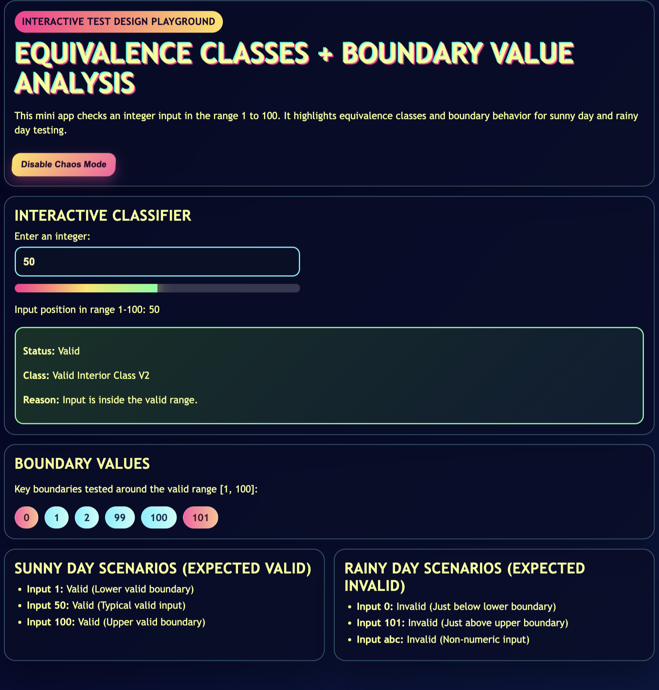
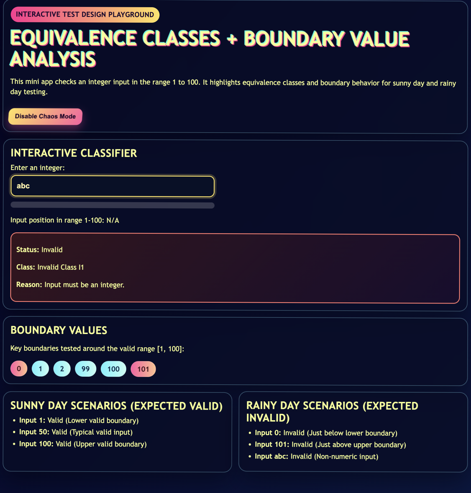

# Equivalence Classes and Boundary Values - Mini Next.js App

## Introduction
This project demonstrates two black-box test design techniques:

1. Equivalence Class Partitioning (ECP)
2. Boundary Value Analysis (BVA)

The sample app validates an integer input where the valid range is 1 to 100.

### Methodology
Equivalence classes used in the app:

- Valid Boundary Class V1: input is exactly 1 or 100
- Valid Interior Class V2: input is an integer from 2 to 99
- Invalid Class I0: empty input
- Invalid Class I1: non-integer or non-numeric input
- Invalid Class I2: integer less than 1
- Invalid Class I3: integer greater than 100

Boundary values tested in the app:

- 0 (just below lower boundary)
- 1 (lower boundary)
- 2 (just above lower boundary)
- 99 (just below upper boundary)
- 100 (upper boundary)
- 101 (just above upper boundary)

### When This Test Case Should Be Used
Use ECP and BVA when:

- Inputs can be grouped into clear valid and invalid classes
- Rules include min and max limits (ranges)
- You want to reduce test count while preserving defect detection power
- UI forms or API contracts include numeric, date, or length constraints

### Limitations
These techniques are strong for input validation but do not fully cover:

- Complex state transitions across multiple screens
- Timing/concurrency issues
- Integration failures between systems
- Hidden business rules not represented in the input range specification

## Vibe Coding Assignment
A mini frontend app was implemented in Next.js to illustrate both sunny day and rainy day scenarios.

### Sunny Day Scenarios
Expected valid behavior:

- Input 1 returns Valid (exact lower boundary)
- Input 50 returns Valid (typical interior value)
- Input 100 returns Valid (exact upper boundary)

### Rainy Day Scenarios
Expected invalid behavior:

- Input 0 returns Invalid (below lower boundary)
- Input 101 returns Invalid (above upper boundary)
- Input abc returns Invalid (non-numeric input)

### Small Code Snippets
Classifier logic excerpt:

    if (parsed < 1) {
      return { status: "Invalid", reason: "Input is below 1.", equivalenceClass: "Invalid Class I2" };
    }

    if (parsed > 100) {
      return { status: "Invalid", reason: "Input is above 100.", equivalenceClass: "Invalid Class I3" };
    }

Boundary values list:

    const boundaryValues = [0, 1, 2, 99, 100, 101];

### Screenshots
Insert screenshots in the folder public/screenshots and keep these names.

1. Main app view with boundary chips and classifier panel

2. Sunny day scenario example (for example input 50)

3. Rainy day scenario example (for example input 0 or abc)

## Conclusion
### Problems Encountered

- Defining classes that are mutually exclusive and complete required careful wording.
- Handling empty, non-numeric, and out-of-range values separately improved clarity.
- Choosing representative boundary-adjacent values was important to avoid redundant test cases.

### Lessons Learned About AI Tools

- AI tools accelerate scaffolding and boilerplate generation for frontend projects.
- AI is useful for quickly generating initial test classes and scenario ideas.
- Manual review is still essential to confirm that test classes reflect the exact requirements.
- Combining AI output with human validation gives stronger and more trustworthy test artifacts.

## Run Instructions
From this folder:

1. npm install
2. npm run dev
3. Open http://localhost:3000

Then capture screenshots and place them in public/screenshots using the filenames above.
