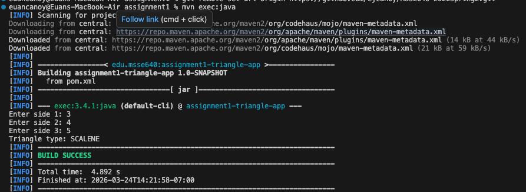
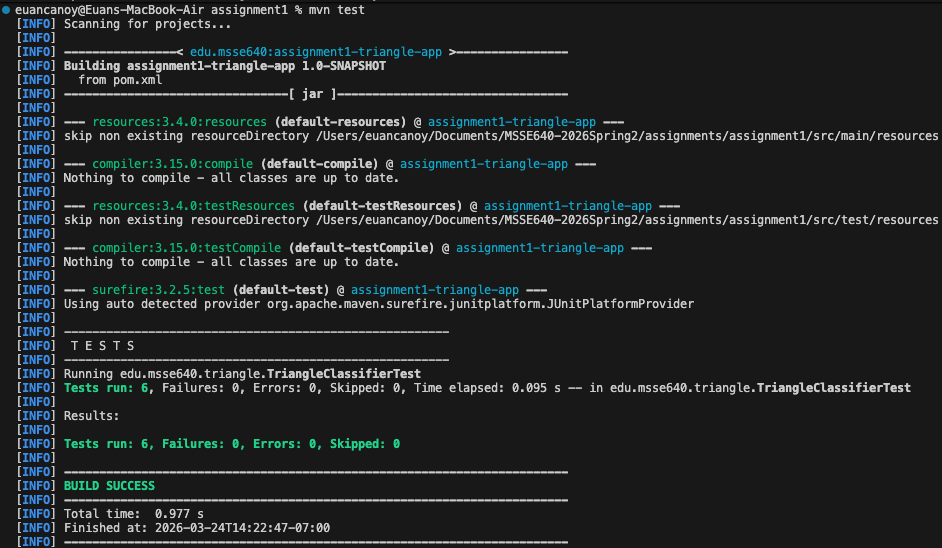

# Assignment 1: Triangle Validator and Classifier

This folder contains the complete submission for Assignment 1.

## Introduction
This project is a Java console application that accepts three side lengths from user input, determines whether the triangle is valid, and reports the triangle type as equilateral, isosceles, or scalene.

Error handling was implemented using both program logic and input validation:
- Program logic marks invalid triangles when sides are zero/negative or violate triangle inequality.
- Input validation handles non-numeric user input and prints a clear error message.

Unit tests were chosen to cover core functional behavior and rainy day cases, including valid triangle classification, side-order invariance for scalene triangles, and invalid inputs.

## Details of the Program
- Language: Java
- Testing library: JUnit 5
- Build tool: Maven
- IDE used: Visual Studio Code

How data is entered:
- The driver program prompts users at the console for side 1, side 2, and side 3.
- Values are read through Scanner in the main method.

How output is produced:
- Results are printed to the console.
- No output files are generated.

Main files:
- src/main/java/edu/msse640/triangle/TriangleApp.java
- src/main/java/edu/msse640/triangle/TriangleClassifier.java
- src/main/java/edu/msse640/triangle/TriangleType.java
- src/test/java/edu/msse640/triangle/TriangleClassifierTest.java

## Table with Example Test Data
| Input Sides | Expected Valid? | Expected Type | Purpose |
| --- | --- | --- | --- |
| 3, 3, 3 | Yes | EQUILATERAL | Basic equal-side happy path |
| 5, 5, 3 | Yes | ISOSCELES | Two equal sides |
| 4, 5, 6 | Yes | SCALENE | Three different sides |
| 4, 6, 5 | Yes | SCALENE | Scalene order permutation |
| 0, 4, 4 | No | INVALID | Rainy day: zero-length side |
| -1, 4, 4 | No | INVALID | Rainy day: negative side |
| 1, 2, 3 | No | INVALID | Triangle inequality violation |
| a, 2, 3 | No | N/A | Non-numeric input handling |

## Unit Tests
The project includes six JUnit tests:
- shouldClassifyEquilateral
- shouldClassifyIsosceles
- shouldClassifyScalene
- shouldClassifyScaleneInAllOrders
- shouldReturnInvalidForNonPositiveSides
- shouldReturnInvalidForTriangleInequalityViolation

Why these were chosen:
- They verify core triangle type detection.
- They cover required rainy day conditions (zero/negative values).
- They verify that scalene classification remains correct regardless of side input order.

## Bugs Encountered During Testing
- Initial environment issue: Maven command was not available in the shell at first, which blocked running tests.
- Resolution: Maven was installed/configured, then tests and packaging succeeded.

No logic bugs were found in triangle classification after the current test set was added.

## Problems
- Environment/tooling setup can block progress even when code is correct.
- Floating-point edge cases can be tricky in triangle logic; this implementation currently uses direct comparisons and is appropriate for this assignment scope.

## Screenshots
Successful program run

Successful program test cases

## What Is Included
- Java application that prompts the user for three side lengths.
- Logic to determine whether the triangle is valid.
- Logic to classify triangle type (equilateral, isosceles, scalene).
- Rainy day handling for zero, negative, and non-numeric inputs.
- JUnit 5 unit tests.
- Full rubric writeup sections included in this README.

## Project Structure
- src/main/java/edu/msse640/triangle/TriangleApp.java
- src/main/java/edu/msse640/triangle/TriangleClassifier.java
- src/main/java/edu/msse640/triangle/TriangleType.java
- src/test/java/edu/msse640/triangle/TriangleClassifierTest.java
- pom.xml

## Build and Test
Run these commands from this folder:

mvn clean compile
mvn test
mvn package

## Run the Program
mvn exec:java