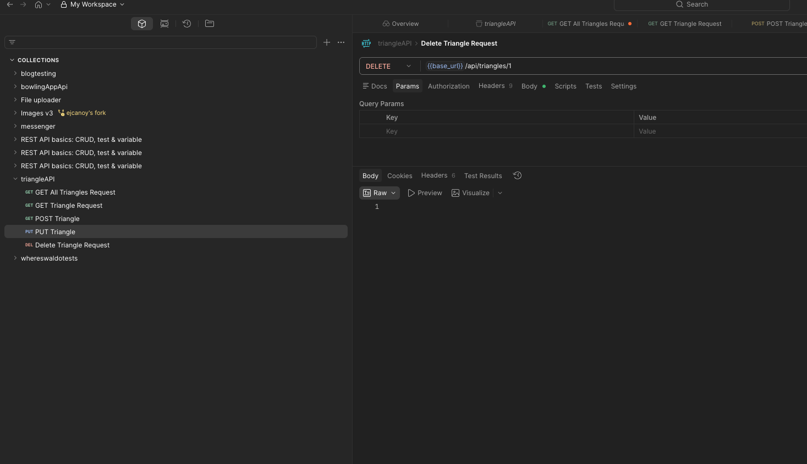
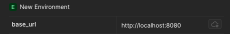
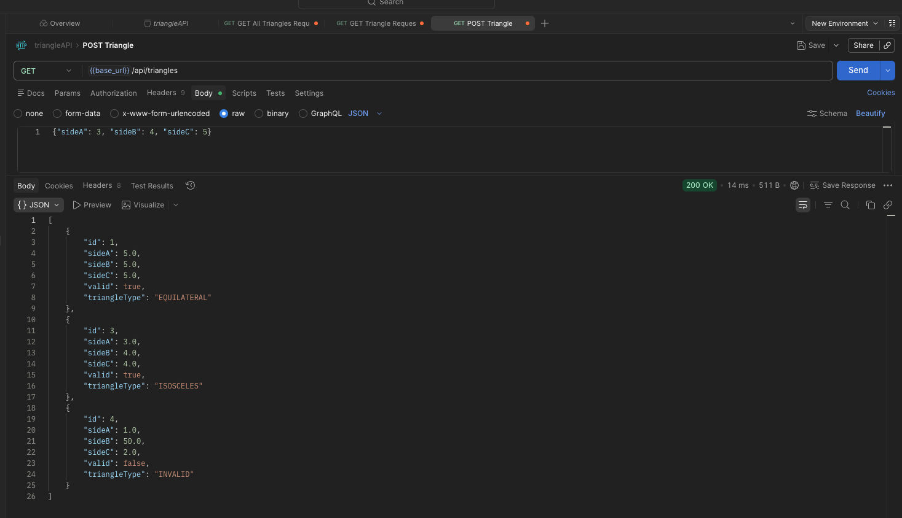
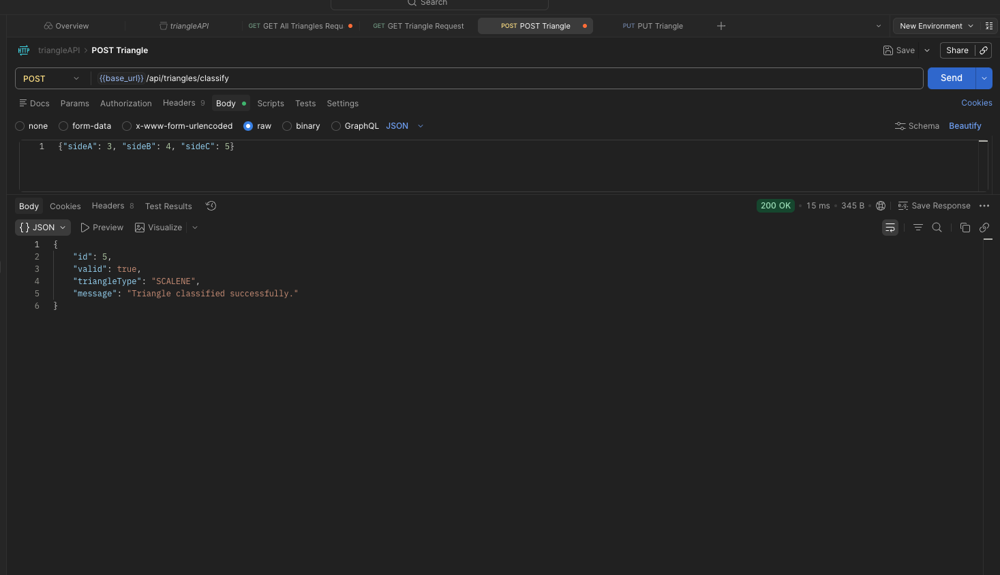
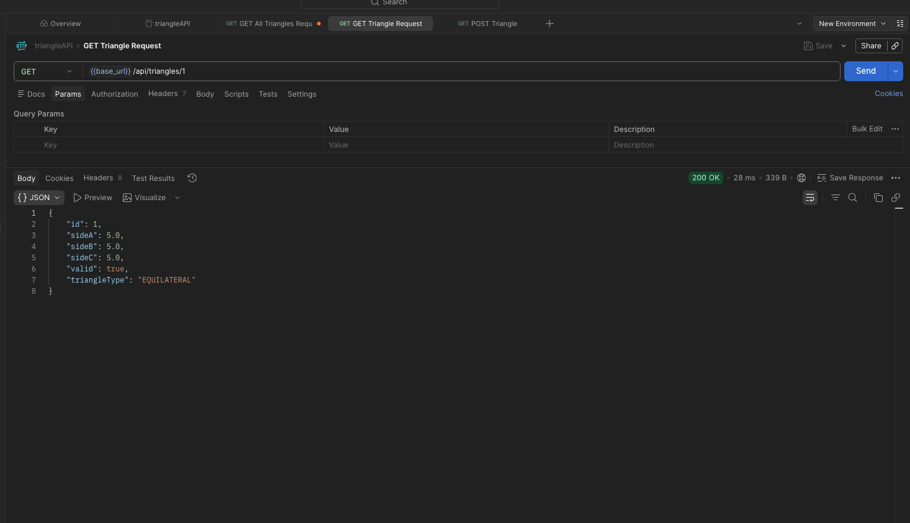
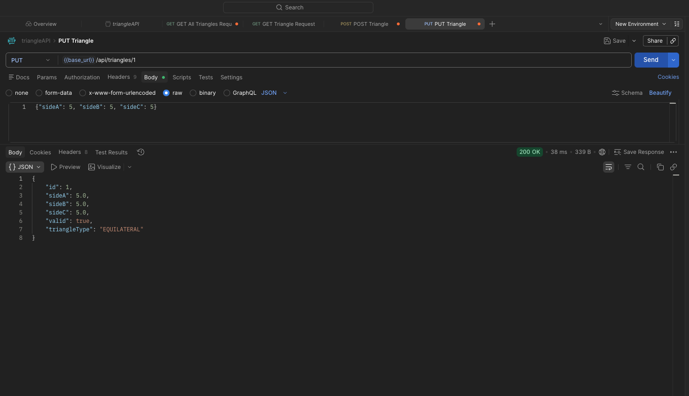
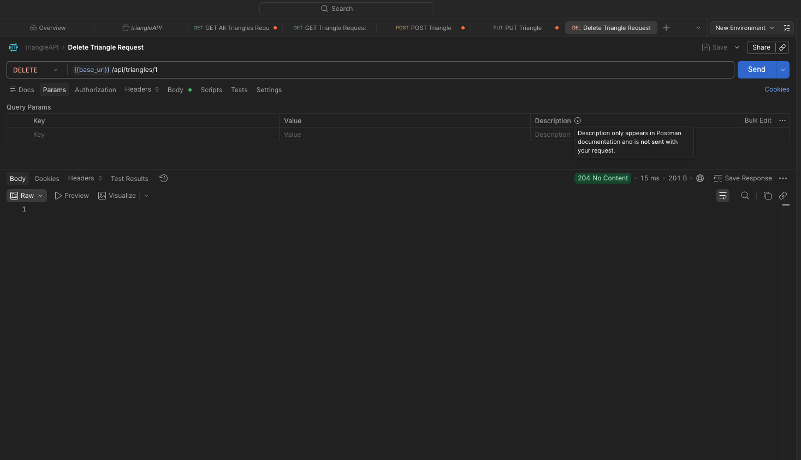
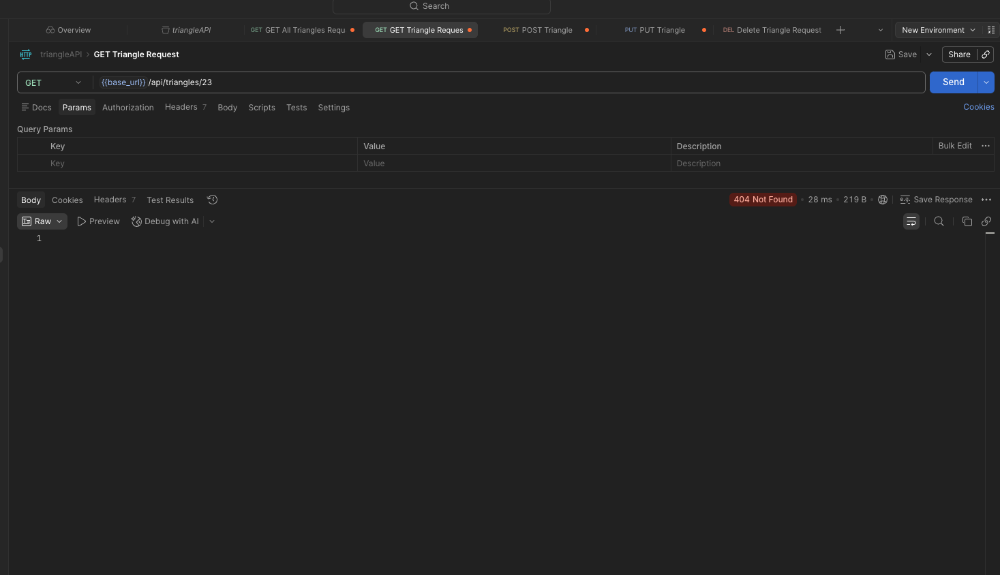
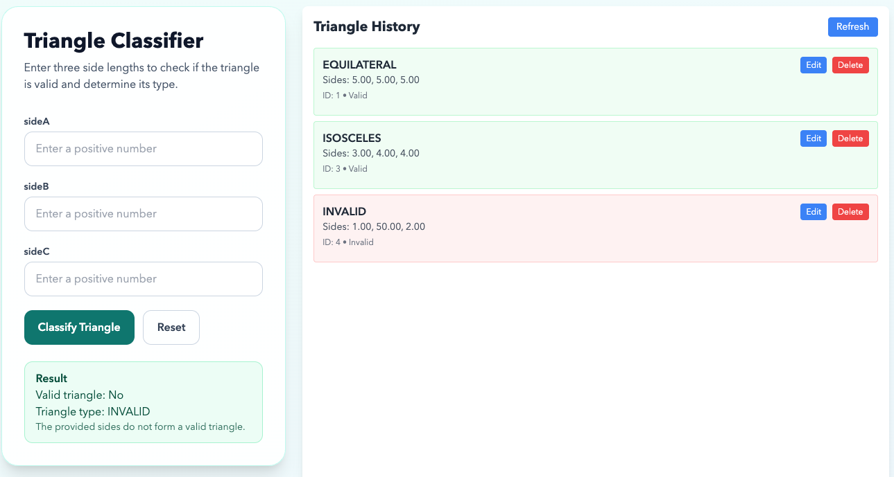
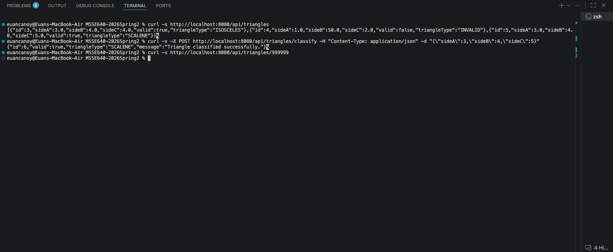

# Assignment 2: APIs and Integration Testing with Postman

## Introduction
This project demonstrates API design, integration testing, and full-stack usage using a Triangle API. The backend is a Spring Boot application with H2 database persistence and CRUD endpoints. The frontend is a React application used to submit triangle data and display results/history.

Main project goals:
- Explain HTTP and API fundamentals.
- Demonstrate API testing in Postman.
- Show persistence behavior during CRUD operations.
- Document request and error responses with screenshots.

## Project Overview
Technology used:
- Backend: Java 17, Spring Boot, Maven, Spring Data JPA, H2
- Frontend: React, Vite, Tailwind CSS
- Testing: JUnit, MockMvc, Vitest
- API testing tool: Postman

Triangle API endpoints used for demo:
- GET /api/triangles
- GET /api/triangles/{id}
- POST /api/triangles/classify
- PUT /api/triangles/{id}
- DELETE /api/triangles/{id}

## Part 1: Research on APIs and Integration Testing

### Basic Functionality of HTTP
HTTP is an application-layer protocol used for communication between clients and servers over the web.

Core concepts:
- Client: The caller that sends a request, such as a browser, mobile app, curl command, or Postman.
- Server: The application that receives requests and returns responses, such as a Spring Boot API.
- Request: The message sent by the client containing method, URL, headers, and optional body.
- Response: The message sent back by the server containing status code, headers, and optional body.
- Headers vs Body:
  - Headers carry metadata such as content type, authorization token, and caching rules.
  - Body carries the main payload, usually JSON for APIs.
- Status codes indicate result category:
- 2xx success, 3xx redirect, 4xx client error, 5xx server error.

Common HTTP verbs:
- GET: Read/fetch data.
- POST: Create a new resource or execute a creation/classification action.
- PUT: Update a resource.
- DELETE: Remove a resource.

Why HTTP is stateless:
- Stateless means each request is independent and includes all needed context.
- The server does not automatically remember prior requests from the same client.
- This improves scalability and reliability, but often requires tokens, session IDs, or other mechanisms when continuity is needed.

### Role of APIs in Modern Applications
APIs allow separate systems to communicate through a defined contract. Modern applications use APIs for frontend-backend communication, third-party integrations, and microservices.

Open APIs:
- Open API can mean a publicly available API and can also refer to the OpenAPI Specification format used to document APIs.
- They are important because they improve interoperability, developer onboarding, testing automation, and integration speed.

Modern Open API usage example:
- Weather applications commonly use the OpenWeather API to fetch current weather and forecasts by city or coordinates.
- The client app calls API endpoints, receives JSON, and renders weather details in UI.
- This avoids building and maintaining a global weather data collection pipeline from scratch.

### Cross-Origin Resource Sharing (CORS)
CORS is a browser security mechanism controlling whether a web app on one origin can access a resource on another origin.

Example in this project:
- Frontend origin: http://localhost:5173
- Backend origin: http://localhost:8080
- Because origins differ, the backend must explicitly allow cross-origin requests.

If CORS is not configured correctly:
- Browser blocks the request before the response is available to JavaScript.

### How APIs Are Secured
Common API security methods:
- HTTPS to encrypt traffic in transit.
- API keys for basic client identification.
- OAuth 2.0 and OpenID Connect for delegated authorization and identity.
- JWT bearer tokens for stateless auth in headers.
- Role-based authorization on protected routes.
- Rate limiting, input validation, and logging for abuse prevention.

To access a secure API, a client typically must:
1. Register an application and get credentials.
2. Obtain an access token or API key.
3. Send credentials in request headers.
4. Call only endpoints allowed by granted scopes/roles.

### Five Public Open APIs
1. OpenWeather API: https://openweathermap.org/api
2. NASA Open APIs: https://api.nasa.gov
3. Open-Meteo API: https://open-meteo.com
4. PokeAPI: https://pokeapi.co
5. REST Countries API: https://restcountries.com

### Sources
1. MDN HTTP Overview: https://developer.mozilla.org/en-US/docs/Web/HTTP/Overview
2. RFC 9110 HTTP Semantics: https://www.rfc-editor.org/rfc/rfc9110
3. MDN CORS Guide: https://developer.mozilla.org/en-US/docs/Web/HTTP/CORS
4. OpenAPI Initiative: https://www.openapis.org
5. OWASP API Security Top 10: https://owasp.org/API-Security/

## Part 2: Postman Video Demo or Test Document with Screenshots

### Postman Setup Checklist
1. Create a collection named Triangle API Integration Tests.
2. Create an environment named Local Triangle API.
3. Add environment variable url with value http://localhost:8080.
4. Refactor all requests to use {{url}}.
5. Create and run at least 6 requests.

Recommended request list:
1. GET {{url}}/api/triangles
2. POST {{url}}/api/triangles/classify (valid triangle)
3. POST {{url}}/api/triangles/classify (invalid triangle)
4. GET {{url}}/api/triangles/{id}
5. PUT {{url}}/api/triangles/{id}
6. DELETE {{url}}/api/triangles/{id}
7. GET {{url}}/api/triangles/{id} after delete (expect error)

### CRUD Persistence Discussion
Persistence behavior in this API:
- Data is persisted in H2 while the backend process is running.
- POST /classify stores both valid and invalid triangle submissions.
- PUT updates existing triangle records.
- DELETE removes the record.

Important note:
- The current database is in-memory, so data resets when the application restarts.

### Example Returned Data
Example success response from classify:
~~~JSON
 {
   "id": 2,
   "valid": true,
   "triangleType": "SCALENE",
   "message": "Triangle classified successfully."
 }
~~~

Example listing response:
~~~JSON
 [
   {
     "id": 1,
     "sideA": 3.0,
     "sideB": 4.0,
     "sideC": 5.0,
     "valid": true,
     "triangleType": "SCALENE"
   }
 ]
~~~

Example error response:
- Request: GET /api/triangles/999999
- Response: 404 Not Found

### Postman Collection and Environment

### Postman Requests and Responses

### UI Screenshots

## Extra Credit: curl Operations
Run at least 3 curl requests and capture screenshots.

Suggested curl commands:
~~~zsh
1. curl -s http://localhost:8080/api/triangles
2. curl -s -X POST http://localhost:8080/api/triangles/classify -H "Content-Type: application/json" -d "{\"sideA\":3,\"sideB\":4,\"sideC\":5}"
3. curl -s http://localhost:8080/api/triangles/999999
~~~

Curl advantages over Postman:
- Fast to run from terminal and easy to automate.
- Great for scripting, CI pipelines, and repeatable checks.
- Easy to version-control as shell scripts.

## Conclusion and Recommendations
This assignment showed how HTTP, APIs, CORS, and security concepts apply in a real implementation and how Postman supports integration testing workflows. The Triangle API demonstrated CRUD operations, JSON handling, and error behavior in a practical way.

Recommendations:
1. Keep an exported Postman collection in the repository.
2. Add persistent file-based or server-based database configuration for non-demo usage.
3. Add authentication before deployment to shared environments.
4. Add negative test cases to Postman tests for validation and error codes.

