# Assignment 3: Performance Testing with JMeter

This folder contains the complete submission for Assignment 3.

## Introduction
This project applies performance testing concepts using Apache JMeter. The assignment focuses on understanding core performance test types, learning key JMeter components, and demonstrating test execution through a test document with screenshots.

The work includes:
- Research and written explanations of performance testing concepts.
- Practical JMeter configuration and execution steps.
- Documentation of results, observations, and recommendations.

## Details of the Project
- Topic: Performance Testing
- Primary tool: Apache JMeter
- Required runtime: JDK (installed and configured)
- Local target app: Spring Boot app in perf-test-app/ for JMeter testing
- Optional deployment target: Team web app, static site, or instructor-provided website
- Deliverable format: Markdown writeup with screenshots and/or video demonstration

How test data is entered:
- Test parameters are configured in JMeter Thread Groups and HTTP Request Samplers.
- Header and request details are configured using JMeter Config Elements.

How output is produced:
- Test execution output is viewed in JMeter listeners (for example, View Results Tree).
- Graphs and screenshots are captured for inclusion in this README.

## Simple Application for JMeter Testing

This assignment includes a simple local web app you can use as your test target.

Location:
- assignments/assignment3/perf-test-app

Run commands:
- cd assignments/assignment3/perf-test-app
- mvn spring-boot:run

Base URL:
- http://localhost:8080

Available endpoints for JMeter GET requests:
- /api/health
	- Purpose: very fast health endpoint for baseline checks
	- Example: http://localhost:8080/api/health
- /api/delay?ms=300
	- Purpose: controlled delay to simulate slower responses
	- Example: http://localhost:8080/api/delay?ms=300
- /api/cpu?workUnits=80000
	- Purpose: CPU work simulation for load and stress tests
	- Example: http://localhost:8080/api/cpu?workUnits=80000
- /api/payload?items=500
	- Purpose: larger response payload for throughput testing
	- Example: http://localhost:8080/api/payload?items=500

Suggested JMeter request defaults:
- Protocol: http
- Server Name or IP: localhost
- Port Number: 8080
- Method: GET

Suggested headers (HTTP Header Manager):
- Accept: application/json
- User-Agent: JMeter

Configurations used in this submission (short classroom runs):
- Load Testing: 50 threads, ramp-up 60s, loop infinite with thread lifetime enabled, duration 300s, endpoint /api/health
- Endurance Testing (shortened): 30 threads, ramp-up 60s, loop infinite with thread lifetime enabled, duration 600s, endpoint /api/delay?ms=200
- Stress/Spike Testing (Ultimate Thread Group): endpoint /api/cpu?workUnits=100000 with this schedule:
	- Row 1: start 30 threads, initial delay 0s, startup 30s, hold 105s, shutdown 10s
	- Row 2: start 100 threads, initial delay 45s, startup 30s, hold 15s, shutdown 10s
	- Observed shape: baseline ~30 users, spike to ~130 users, then recovery to ~30 users, then stop

JMeter listeners/plugins used:
- View Results Tree
- Graph Results
- jp@gc Active Threads Over Time (JMeter-Plugins.org, jmeter-plugins-graphs-basic)
- Custom Thread Groups plugin (JMeter-Plugins.org, jmeter-plugins-casutg 3.1.1)
	- Thread group used for spike test: jp@gc Ultimate Thread Group
	- Documentation: https://jmeter-plugins.org/wiki/ConcurrencyThreadGroup/
	- Maven coordinates: kg.apc:jmeter-plugins-casutg:3.1.1

## Part 1: Research on Performance Testing and JMeter

### A. Types of Performance Tests
Performance testing measures how an application behaves under different levels and patterns of traffic. The three required test types are useful for different risks.

Load testing
- Purpose: verifies whether the system can handle expected day-to-day traffic levels.
- Typical setup used here: 50 concurrent users, ramp-up 60 seconds, total test duration 300 seconds.
- What to watch: average response time, 95th percentile response time, throughput, and error rate.
- Interpretation: if response time stays stable and errors remain low, the system is likely ready for normal production demand.

Endurance testing
- Purpose: evaluates stability over long periods at moderate load.
- Typical setup used here: 30 concurrent users, ramp-up 60 seconds, total test duration 600 seconds (shortened for class execution time).
- What to watch: memory growth, CPU trends, increased latency over time, and connection/resource leaks.
- Interpretation: gradual performance decline over time often indicates memory leaks, unreleased resources, or inefficient background tasks.

Stress/Spike testing
- Purpose: identifies system limits and recovery behavior during sudden traffic increases.
- Typical setup used here: Ultimate Thread Group with a 30-user baseline and a temporary +100-user surge, reaching about 130 concurrent users before recovery.
- What to watch: failure threshold, timeout rates, server recovery time, and whether service degrades gracefully.
- Interpretation: a resilient system may slow down under spike traffic but should recover quickly once load drops.

Required graph notes for this assignment:
- Graph 1 (Load): X-axis is Time, Y-axis is Number of Threads, with a smooth ramp to target load.

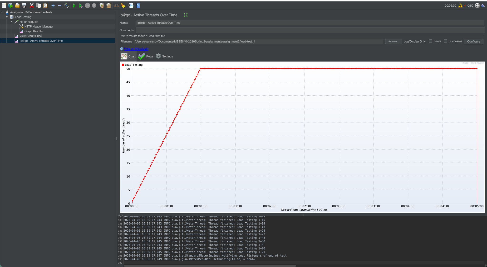

- Graph 2 (Endurance): X-axis is Time, Y-axis is Number of Threads, with a stable thread level over longer duration.

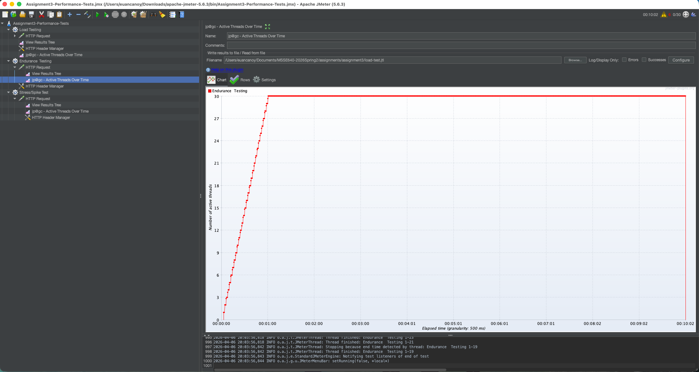

- Graph 3 (Stress/Spike): X-axis is Time, Y-axis is Number of Threads, showing a rapid rise and drop pattern.

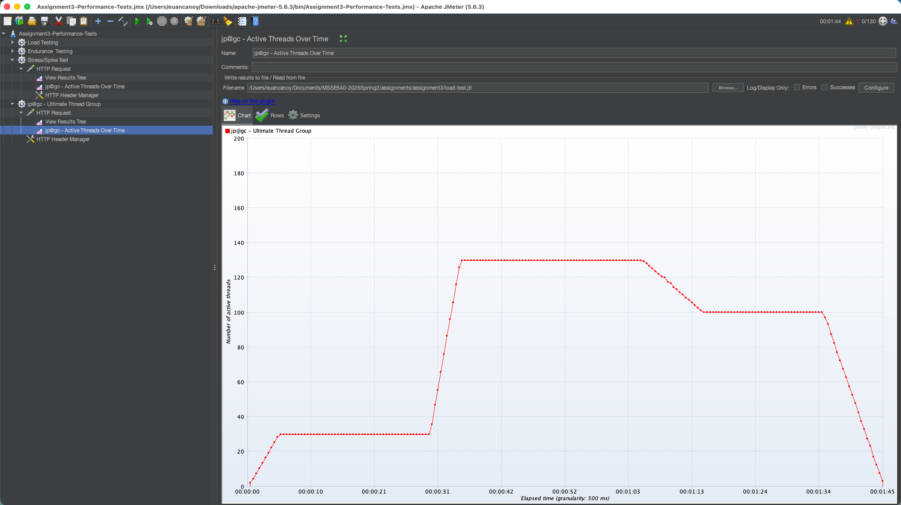

### B. JMeter Components
JMeter uses modular components to define how virtual users send requests and how results are captured.

Thread Groups
- Role: controls virtual users and schedule.
- Main settings: Number of Threads (users), Ramp-up Period, and Loop Count or test duration.
- Why it matters: this component defines concurrency and traffic shape, which directly drives load profile and test realism.

HTTP Request Sampler
- Role: sends HTTP/HTTPS requests to a target endpoint.
- Main settings: Protocol, Server Name/IP, Port, Method (GET/POST), Path, query parameters, and request body.
- Why it matters: this sampler represents user actions and is the core transaction being measured.

Config Elements
- Role: provides shared request configuration.
- Common element used in this assignment: HTTP Header Manager.
- Example headers: Accept: application/json and Content-Type: application/json when needed.
- Why it matters: centralizes reusable configuration and keeps requests consistent across samplers.

Listeners
- Role: displays and stores test results.
- Common listener used in this assignment: View Results Tree.
- Other useful listeners: Summary Report, Aggregate Report, and Response Time Graph.
- Why it matters: listeners provide evidence for screenshots and metrics needed in analysis.

### C. Application Performance Index
Application Performance Index (Apdex) is a standard score that summarizes user satisfaction with response times. Instead of only showing raw latency numbers, Apdex translates performance into a simple value between 0 and 1.

How it works:
- Define a target response time threshold T (for example, 500 ms).
- Categorize each response:
	- Satisfied: response time is less than or equal to T.
	- Tolerating: response time is greater than T but less than or equal to 4T.
	- Frustrated: response time is greater than 4T or request fails.

Formula:
- Apdex = (Satisfied Count + 0.5 x Tolerating Count) / Total Samples

How Apdex helps performance evaluation:
- Converts many timing samples into one easy-to-compare score.
- Aligns technical metrics with user experience.
- Helps compare test runs over time after configuration or code changes.
- Supports release decisions by setting minimum acceptable satisfaction targets.

Example interpretation:
- 0.94 to 1.00: excellent user experience.
- 0.85 to 0.93: good but with some noticeable delays.
- below 0.85: performance likely impacts user satisfaction and needs improvement.

## Table with Example Test Plan Data
| Test Type | Objective | Example Thread Setup | Duration/Ramp Pattern | Expected Observation |
| --- | --- | --- | --- | --- |
| Load | Validate expected production traffic | 50 users | Ramp 0-50 over 60 sec, run 300 sec | Stable response times and low error rate |
| Endurance | Check long-running stability | 30 users | Ramp 0-30 over 60 sec, run 600 sec | No memory/resource degradation trend in short run |
| Stress/Spike | Find breaking point and recovery behavior | 30 baseline + 100 surge (peak ~130) | Baseline ramp 30s, surge starts at 45s and ramps 30s, short hold, then recovery | Increased latency/errors near peak, recovery after spike |

## Part 2: JMeter Video Demo or Test Document with Screenshots
The assignment requires demonstrating the following steps in JMeter.

### Demo 1: Load Testing
Steps performed:
- Create Thread Group named Load Testing.
- Configure users/ramp-up/duration.
- Add HTTP Request sampler (GET /api/health).
- Add HTTP Header Manager (Accept and User-Agent).
- Add listeners (View Results Tree and jp@gc Active Threads Over Time).
- Run test and capture setup and result screenshots.

Setup screenshots:
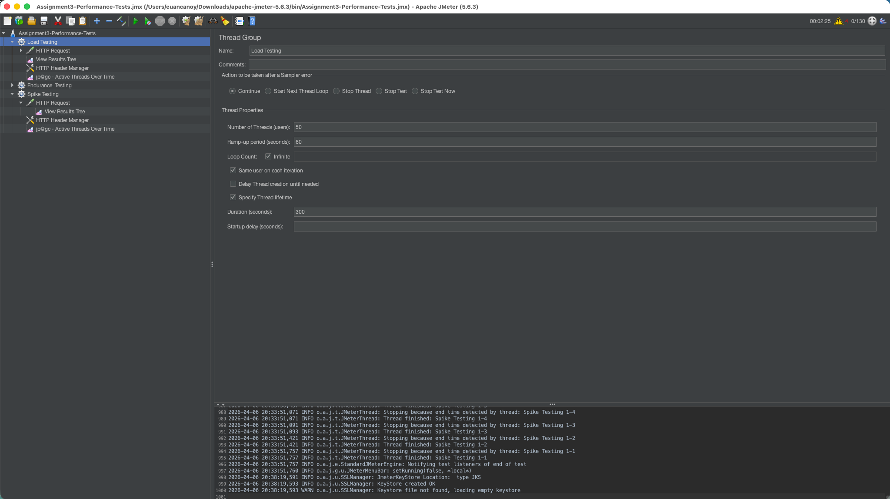
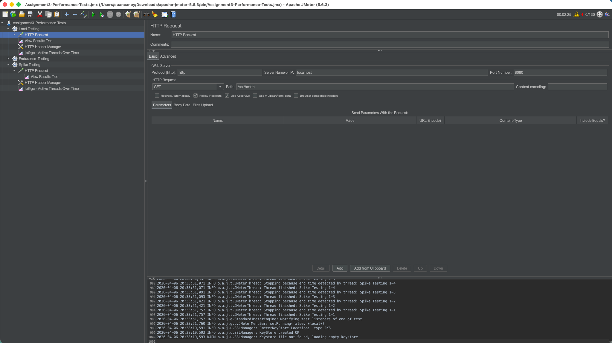
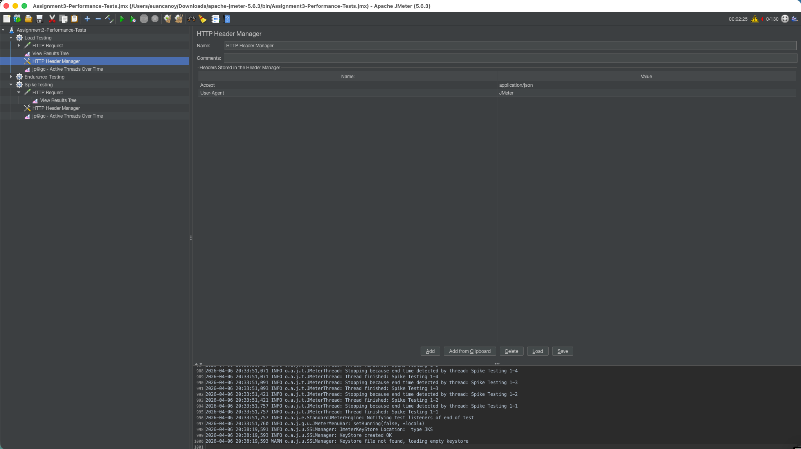

Result screenshots:
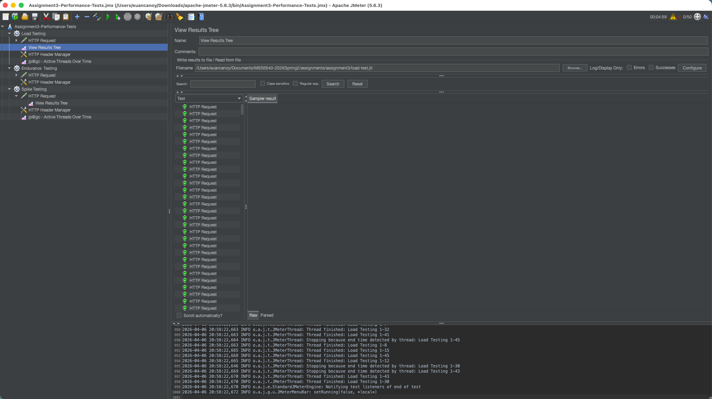

### Demo 2: Endurance Testing
Steps performed:
- Create Thread Group named Endurance Testing.
- Configure users/ramp-up/duration.
- Add HTTP Request sampler (GET /api/delay?ms=200).
- Add HTTP Header Manager (Accept and User-Agent). Headers were all the same
- Add listeners (View Results Tree and jp@gc Active Threads Over Time).
- Run test and capture setup and result screenshots.

Setup screenshots:
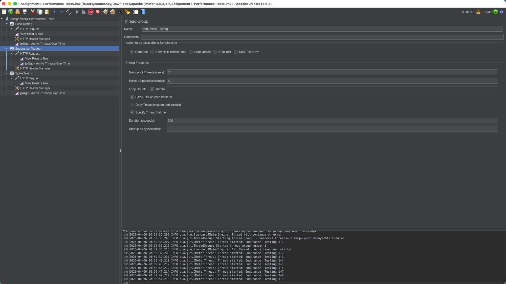
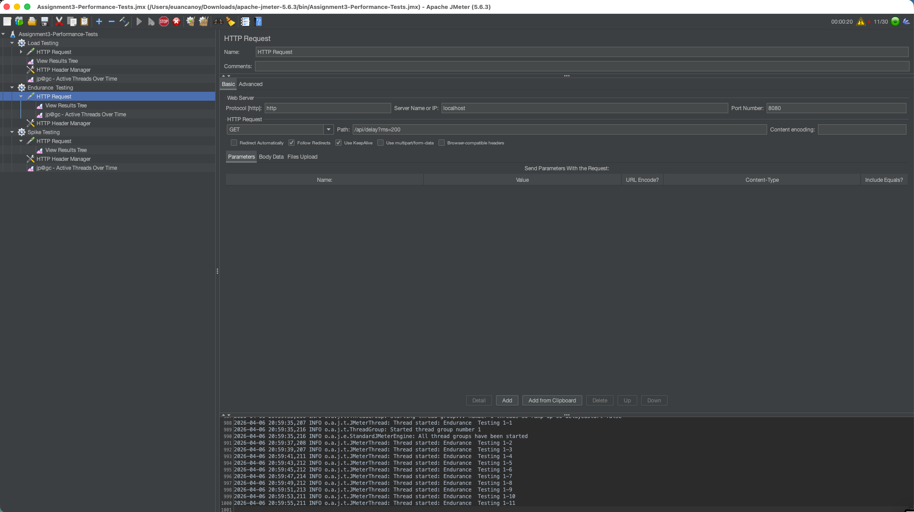

Result screenshots:
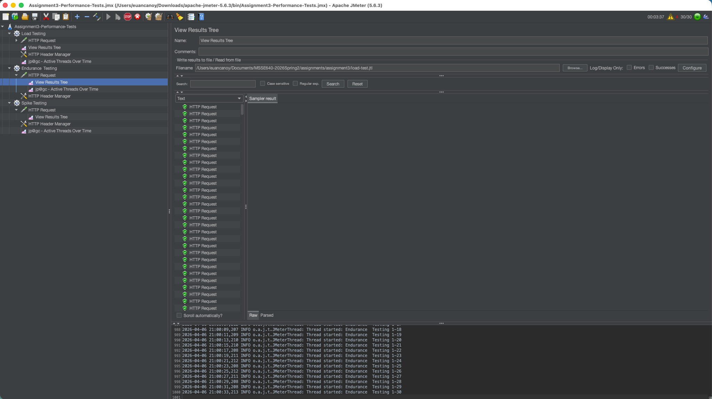

### Demo 3: Stress/Spike Testing
Steps performed:
- Create jp@gc Ultimate Thread Group named Spike Testing.
- Configure baseline and spike schedule.
- Add HTTP Request sampler (GET /api/cpu?workUnits=100000).
- Add HTTP Header Manager (Accept and User-Agent).
- Add listeners (View Results Tree and jp@gc Active Threads Over Time).
- Run test and capture setup and result screenshots.

Setup screenshots:
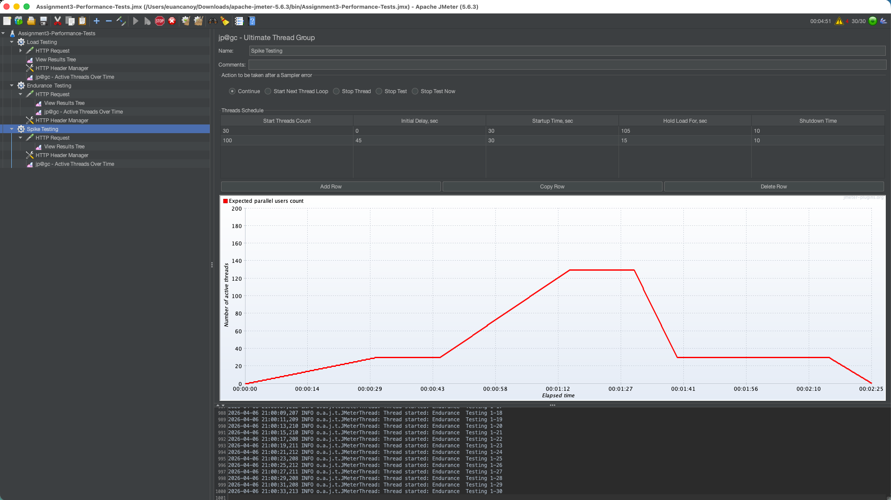
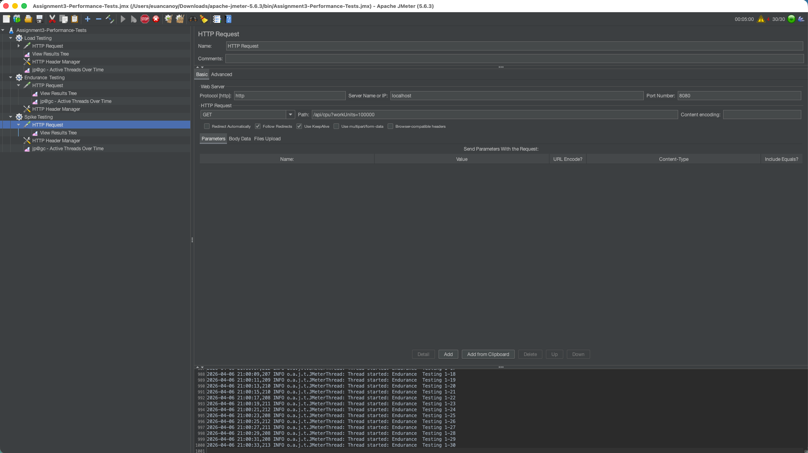

Result screenshots:
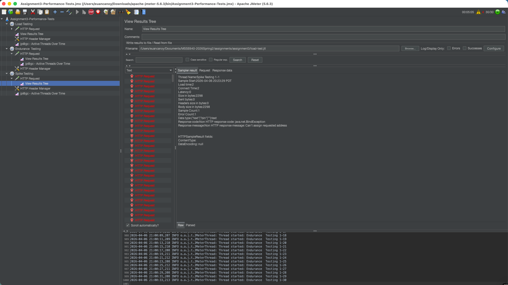

## Screenshots and/or Video Evidence
Part 1 required graphs (Time on X-axis, Number of Threads on Y-axis)

Graph 1: Load test

Graph 2: Endurance test

Graph 3: Stress/Spike test

Part 2 setup and execution evidence
- See Demo 1, Demo 2, and Demo 3 sections above for all screenshot placeholders.

Video demo link (if submitted)
- Add your video URL here

## Extra Credit
What Linux commands can be used to test and evaluate performance on a VM or server?

Examples:
- top, htop (CPU and memory process usage)
- vmstat (memory, process, I/O, CPU summary)
- iostat (disk I/O and CPU stats)
- sar (historical and interval-based system activity)
- free -h (memory usage)
- df -h (filesystem capacity)
- netstat or ss (network sockets and connection stats)
- uptime (load averages)

## Conclusion and Recommendations
This assignment improved understanding of how performance testing differs from functional testing by focusing on throughput, concurrency, latency, and system stability over time. JMeter provided a practical way to model realistic user behavior with configurable thread groups, samplers, headers, and listeners.

Recommendations to improve this assignment:
- Provide a common sample endpoint for students who cannot deploy an app.
- Include a starter JMeter template file for beginners.
- Add a minimum required metric checklist (response time, throughput, error rate).
- Clarify expected depth of graph analysis in the writeup.

## What Is Included
- Complete markdown writeup for Project 3 requirements.
- Runnable Spring Boot test application for local performance testing.
- Placeholders for required research graphs and JMeter screenshots.
- Structured sections aligned to the assignment rubric.
- Extra credit Linux performance command examples.
- Conclusion and actionable recommendations.

## Project Structure
- README.md
- images/ (recommended location for screenshots and graphs)
- perf-test-app/
	- pom.xml
	- src/main/java/edu/msse640/perftest/PerfTestApplication.java
	- src/main/java/edu/msse640/perftest/web/TestController.java
	- src/main/resources/application.properties

## References
- JMeter User Manual: https://jmeter.apache.org/usermanual/index.html
- JMeter Tutorials: https://www.softwaretestinghelp.com/jmeter-tutorials/
